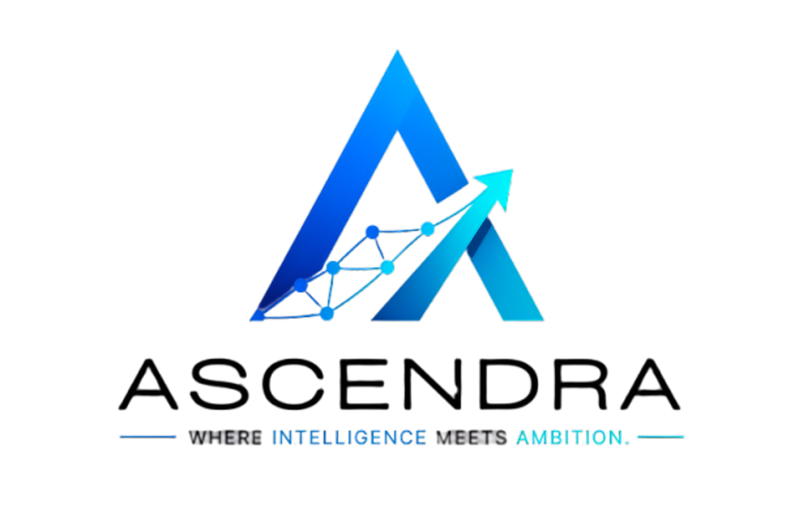

# ASCENDRA

> **Where Intelligence Meets Ambition.**



ASCENDRA is an enterprise-grade, AI-powered learning and career acceleration platform built for computer science students and engineers. It provides a complete end-to-end learning lifecycle—combining structured course pathways, adaptive practice diagnostics, an online coding workspace (CodeLab), AI-proctored placement interview rehearsals, and real-time skill analytics.

---

## 🌟 Key Features

### 1. 🛡️ Authentication & Biometrics
- **Multi-Role Authentication**: Seamless JWT & session flow supporting Student, Faculty, and Admin roles.
- **Biometric Face Enrollment**: High-accuracy face descriptor registration powered by `face-api.js`.

### 2. ⚡ AI Command Center Dashboard
- **Real-Time Telemetry**: Instant overview of global rank, study hours, active streaks, and practice accuracy.
- **AI Recommendation Engine**: Contextually suggests next lessons, weak topics to review, coding challenges, and mock interviews.
- **Recent Activity Timeline**: Chronological tracking of completed lessons, quizzes, coding solutions, and interview rehearsals.

### 3. 📚 Learning Workspace
- **Subject & Chapter Roadmaps**: Interactive module breakdowns covering Advanced Data Structures, Dynamic Programming, and System Design.
- **Progress Synchronization**: Instant lesson completion state persistence across sessions.

### 4. 🎯 Practice & Quiz Engine
- **Adaptive Question Bank**: Multi-category aptitude, technical, and reasoning diagnostic modules.
- **Live Timers & Analytics**: Immediate result breakdowns with detailed feedback on correct vs. incorrect answers.

### 5. 💻 CodeLab Workspace
- **Multi-Language IDE**: Lightweight online editor powered by Monaco Editor (`@monaco-editor/react`).
- **Test Case Execution**: Interactive console panels, custom test inputs, and solution verification.
- **AI Code Review**: Automated feedback on time complexity, memory efficiency, and edge case coverage.

### 6. 🎙️ AI Interview Studio & Proctoring
- **Simulated Placement Rehearsals**: Full camera check, microphone check, and dynamic AI technical interviews.
- **Real-Time Proctoring**: Multi-face detection, head pose estimation (Yaw/Pitch), gaze stability tracking, and loud noise monitoring using `useProctor`.
- **Evaluation Reports**: Instant post-interview scorecards with gaze compliance indices and strike logs.

### 7. 🤖 AI Coach Mentor
- **Interactive Coach**: Realistic AI guidance tailored to student weak areas, study schedules, and placement readiness.
- **Quick Prompts Bar**: Pre-configured queries for instant study advice, weak topic review, and interview prep.

---

## 🏗️ Architecture & Technology Stack

| Layer | Technologies Used |
| :--- | :--- |
| **Frontend Framework** | React 19, Vite 8, React Router v7 |
| **Styling & UI** | TailwindCSS v4, Framer Motion, Lucide Icons |
| **AI & Computer Vision** | `face-api.js` (TinyFaceDetector, FaceLandmark68, FaceRecognition) |
| **3D Graphics & Canvas** | Three.js, `@react-three/fiber`, `@react-three/drei` |
| **Code Editor** | Monaco Editor (`@monaco-editor/react`) |
| **State Management** | Custom Hooks, LocalStorage Synchronization, React State |
| **Backend & API** | Node.js, Express.js, REST API Services |
| **Build & Tooling** | Vite, ESLint, PostCSS |

---

## 📂 Project Folder Structure

```
ASCENDRA/
├── public/
│   └── ascendra-logo.png
├── src/
│   ├── assets/             # Static visual assets
│   ├── components/         # Reusable UI component modules
│   │   ├── 3d/             # Three.js 3D Hero canvas components
│   │   ├── aimentor/       # AI Coach header, panels, and chat UI
│   │   ├── auth/           # Login, Signup & Webcam components
│   │   ├── codelab/        # Monaco code editor, toolbar, output panels
│   │   ├── common/         # Navbar, Sidebar, PageLoader, SplashScreen, Toast
│   │   ├── dashboard/      # Command center widgets, charts & trackers
│   │   ├── interview/      # Interview headers, camera preview, proctoring
│   │   ├── learn/          # Subject, chapter, and lesson components
│   │   ├── practice/       # Practice sets & timer components
│   │   └── quiz/           # Quiz question cards & result views
│   ├── contexts/           # React ThemeContext providers
│   ├── features/           # Mock data and domain features
│   ├── hooks/              # Custom hooks (useAuthStore, useFaceDetection, useProctor)
│   ├── layouts/            # AppShell & layout wrappers
│   ├── pages/              # Lazy-loaded page components
│   ├── utils/              # Axios API helpers & utility methods
│   ├── App.css             # Micro-interaction CSS utilities
│   ├── App.jsx             # Root Router & Lazy Route Definitions
│   └── main.jsx            # Application entry point
├── index.html              # Main HTML document with SEO meta tags
├── package.json            # Package dependencies and npm scripts
└── vite.config.js          # Vite build configuration
```

---

## 🚀 Getting Started

### Prerequisites
- Node.js (v18.0 or higher)
- npm (v9.0 or higher)

### Installation

1. **Clone the Repository**:
   ```bash
   git clone https://github.com/GuntiPrasanthKumar/ASCENDRA.git
   cd ASCENDRA
   ```

2. **Install Dependencies**:
   ```bash
   npm install
   ```

3. **Start Development Server**:
   ```bash
   npm run dev
   ```
   Open [http://localhost:5173](http://localhost:5173) in your browser.

4. **Build for Production**:
   ```bash
   npm run build
   ```

5. **Run Linter**:
   ```bash
   npm run lint
   ```

---

## 🗺️ Roadmap & Future Enhancements

- [ ] **Live Backend LLM Integration**: Connect AI Coach and CodeLab review engine to Google Gemini API / Anthropic Claude API.
- [ ] **Multi-Participant Mock Interviews**: Group technical discussions and peer-to-peer code reviews.
- [ ] **Mobile Native Companion App**: React Native mobile app for daily practice flashcards.

---

## 📜 License

This project is licensed under the [MIT License](LICENSE).
